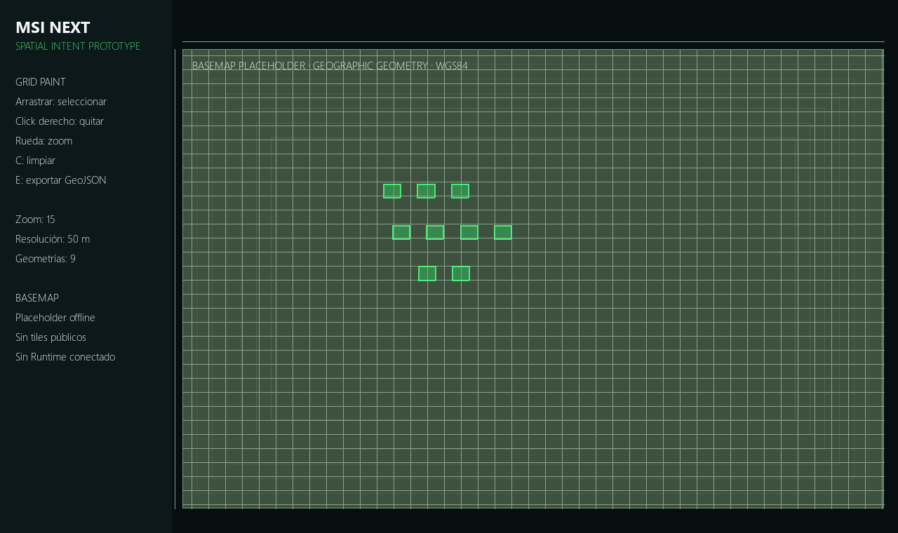

# MSI Next geospatial architecture and provider research

Status: researched proposal plus isolated adaptive-grid prototype.

## Coordinate and geometry model

- Canonical persistence/exchange: WGS84 longitude/latitude (`EPSG:4326`) with explicit altitude reference and accuracy.
- Display: Web Mercator (`EPSG:3857`) when required by slippy maps; never use it as mission truth.
- Local precision: future local projected CRS/ENU frame selected per environment for measurement and planning.
- Geometry: Point, LineString, Corridor, Polygon, MultiPolygon, exclusion areas and orientation constraints.
- Grid: view-dependent quantization of human intent. It exports geographic polygons; cell row/column are not operational identifiers.
- Layers: basemap, environment, operator selection, interpreted geometry, verified geometry, restrictions, work state, resources, observations and optional engineering routes.

## Adaptive grid proof

The prototype in `experiments/msi_next_geospatial` supports paint, erase, zoom, touch/pointer input, clear and GeoJSON export. Resolution steps are currently experimental: 500, 200, 50, 20 and 5 metres. Existing selections remain geographic when zoom changes.

Run:

```powershell
manager\mission_studio\.venv\Scripts\python.exe -m experiments.msi_next_geospatial.prototype
```



## Provider research

| Option | Advantages | Disadvantages | License/data duties | Offline | Touch | Python/current stack | TAB future | Risk |
|---|---|---|---|---|---|---|---|---|
| OSM public raster tiles | Immediate familiar map | Best-effort, no SLA; offline/prefetch prohibited | Visible OSM attribution; follow tile policy | No | Renderer-dependent | HTTP/image integration possible | Weak production basis | High for production |
| MapLibre GL JS | Vector/raster layers, styles, WebGL, mature interactions | Browser/webview boundary and JS packaging | Open-source library; tile/style/data licenses separate | Yes with suitable source | Strong | Bridge required from Python | Strong | Medium |
| MapLibre Native | Native engine and mobile ecosystem | Desktop Python integration/packaging must be proven | Open-source engine; data duties separate | Yes | Strong | No direct low-risk Pygame path | Strong | Medium/high |
| OpenLayers | Broad GIS formats, projections, drawing/modification, mobile ready | Browser boundary; more GIS complexity exposed if poorly designed | BSD-2-Clause library; source data duties separate | Yes with source | Strong | Webview/bridge | Strong | Medium |
| Leaflet | Simple, lightweight, broad plugin ecosystem | Raster-first; complex vector/offline workflows need plugins | BSD-2-Clause; provider attribution required | Possible with lawful source | Good | Webview/bridge | Good | Medium |
| PMTiles | Single-file archive, range requests, no custom tile backend | Archive generation/distribution remains MSI responsibility | BSD-3-Clause implementations; underlying data license applies | Excellent | Engine-dependent | Can sit behind web/native map adapter | Excellent | Low/medium |
| OpenMapTiles/MBTiles | Self-host/offline vector tiles and known schema | Generation tooling is heavy; attribution includes OSM+OpenMapTiles | BSD code, CC-BY design/schema, ODbL data duties | Excellent | Engine-dependent | External generation/server/bridge | Good | Medium |
| Shapely/GEOS | Robust immutable vector geometry and GeoJSON interoperability | Not a map renderer; native dependency | Shapely BSD-3, GEOS LGPL | Yes | N/A | Excellent Python integration | Backend/shared service | Low |

## Recommendation

1. Keep `MapProvider` and split it into basemap metadata/content versus geometry/overlay services.
2. Adopt GeoJSON-compatible domain messages now; evaluate Shapely later behind `GeometryService`, not throughout domain code.
3. For the first real-map spike, test MapLibre GL JS + PMTiles in an isolated web surface with a legally obtained small area extract and visible attribution.
4. Do not use `tile.openstreetmap.org` for offline packages, bulk download or operational availability.
5. Keep satellite/orthomosaic as separate providers because OSM does not supply satellite imagery.

## Primary sources

- [OpenStreetMap Tile Usage Policy](https://operations.osmfoundation.org/policies/tiles/)
- [OpenStreetMap copyright and attribution](https://www.openstreetmap.org/copyright)
- [MapLibre GL JS documentation](https://maplibre.org/maplibre-gl-js/docs/)
- [OpenLayers overview](https://openlayers.org/)
- [OpenLayers touch/projection background](https://openlayers.org/doc/tutorials/background.html)
- [Leaflet reference](https://leafletjs.com/reference)
- [PMTiles project](https://github.com/protomaps/PMTiles)
- [OpenMapTiles documentation](https://openmaptiles.org/docs/)
- [Shapely documentation and licensing](https://shapely.readthedocs.io/en/stable/)

